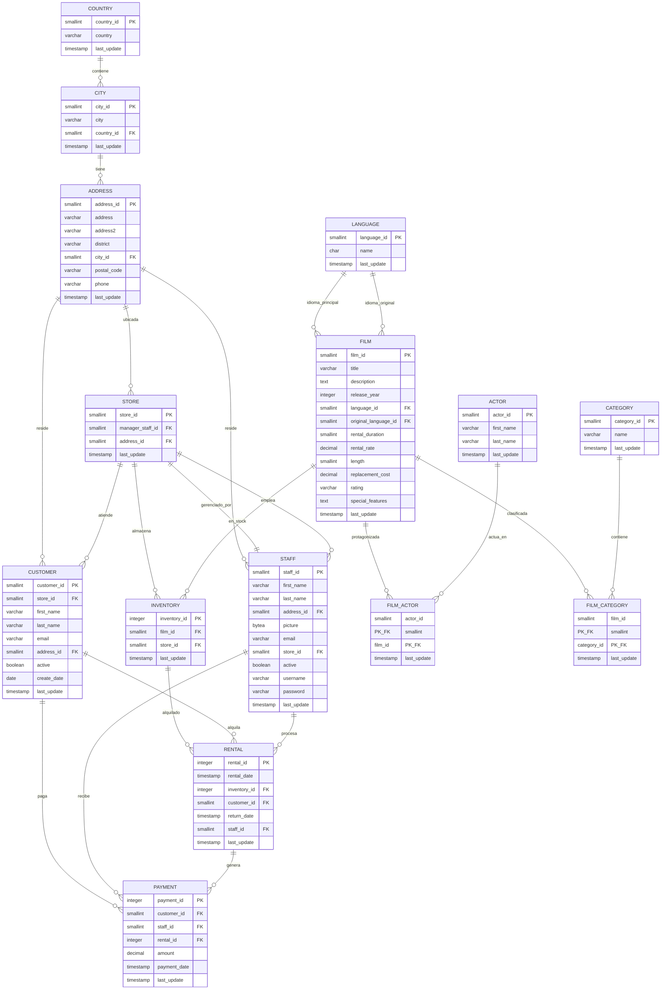

# Diagrama de Base de Datos - Sakila DVD Rental

## Diagrama Entidad-Relación (ERD)

```mermaid
erDiagram
    COUNTRY ||--o{ CITY : "contiene"
    CITY ||--o{ ADDRESS : "tiene"
    ADDRESS ||--o{ CUSTOMER : "reside"
    ADDRESS ||--o{ STAFF : "reside"
    ADDRESS ||--o{ STORE : "ubicada"
    
    STORE ||--o{ CUSTOMER : "atiende"
    STORE ||--o{ INVENTORY : "almacena"
    STORE ||--|| STAFF : "gerenciado_por"
    STORE ||--o{ STAFF : "emplea"
    
    LANGUAGE ||--o{ FILM : "idioma_principal"
    LANGUAGE ||--o{ FILM : "idioma_original"
    
    FILM ||--o{ FILM_ACTOR : "protagonizada"
    ACTOR ||--o{ FILM_ACTOR : "actua_en"
    
    FILM ||--o{ FILM_CATEGORY : "clasificada"
    CATEGORY ||--o{ FILM_CATEGORY : "contiene"
    
    FILM ||--o{ INVENTORY : "en_stock"
    INVENTORY ||--o{ RENTAL : "alquilado"
    
    CUSTOMER ||--o{ RENTAL : "alquila"
    STAFF ||--o{ RENTAL : "procesa"
    
    CUSTOMER ||--o{ PAYMENT : "paga"
    STAFF ||--o{ PAYMENT : "recibe"
    RENTAL ||--o{ PAYMENT : "genera"

    COUNTRY {
        smallint country_id PK
        varchar country
        timestamp last_update
    }
    
    CITY {
        smallint city_id PK
        varchar city
        smallint country_id FK
        timestamp last_update
    }
    
    ADDRESS {
        smallint address_id PK
        varchar address
        varchar address2
        varchar district
        smallint city_id FK
        varchar postal_code
        varchar phone
        timestamp last_update
    }
    
    STORE {
        smallint store_id PK
        smallint manager_staff_id FK
        smallint address_id FK
        timestamp last_update
    }
    
    STAFF {
        smallint staff_id PK
        varchar first_name
        varchar last_name
        smallint address_id FK
        bytea picture
        varchar email
        smallint store_id FK
        boolean active
        varchar username
        varchar password
        timestamp last_update
    }
    
    CUSTOMER {
        smallint customer_id PK
        smallint store_id FK
        varchar first_name
        varchar last_name
        varchar email
        smallint address_id FK
        boolean active
        date create_date
        timestamp last_update
    }
    
    LANGUAGE {
        smallint language_id PK
        char name
        timestamp last_update
    }
    
    CATEGORY {
        smallint category_id PK
        varchar name
        timestamp last_update
    }
    
    ACTOR {
        smallint actor_id PK
        varchar first_name
        varchar last_name
        timestamp last_update
    }
    
    FILM {
        smallint film_id PK
        varchar title
        text description
        integer release_year
        smallint language_id FK
        smallint original_language_id FK
        smallint rental_duration
        decimal rental_rate
        smallint length
        decimal replacement_cost
        varchar rating
        text special_features
        timestamp last_update
    }
    
    FILM_ACTOR {
        smallint actor_id PK_FK
        smallint film_id PK_FK
        timestamp last_update
    }
    
    FILM_CATEGORY {
        smallint film_id PK_FK
        smallint category_id PK_FK
        timestamp last_update
    }
    
    INVENTORY {
        integer inventory_id PK
        smallint film_id FK
        smallint store_id FK
        timestamp last_update
    }
    
    RENTAL {
        integer rental_id PK
        timestamp rental_date
        integer inventory_id FK
        smallint customer_id FK
        timestamp return_date
        smallint staff_id FK
        timestamp last_update
    }
    
    PAYMENT {
        integer payment_id PK
        smallint customer_id FK
        smallint staff_id FK
        integer rental_id FK
        decimal amount
        timestamp payment_date
        timestamp last_update
    }
```

