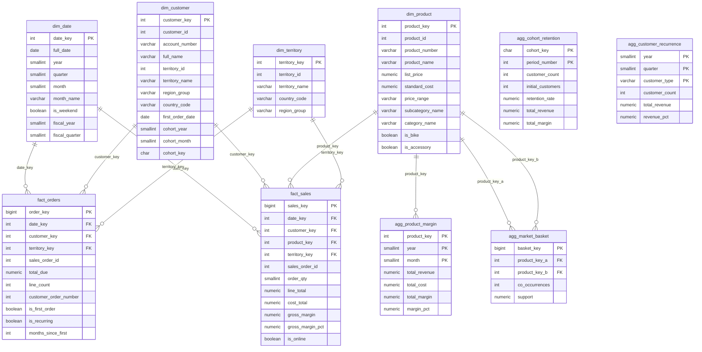

# Diagrama del Data Warehouse — Lab 02

## Modelo Star Schema

---

## Decisiones de Diseño

### ¿Por qué Star Schema?
Se eligió star schema sobre snowflake por su simplicidad de consulta y rendimiento. Las dimensiones están desnormalizadas (p.ej., `category_name` incluido en `dim_product` en vez de tener una tabla separada), lo que reduce los JOINs necesarios.

### Tablas de Hechos
- **`fact_sales`** (granularidad: línea de detalle) — para análisis de margen por producto y market basket.
- **`fact_orders`** (granularidad: cabecera de orden) — para análisis de clientes recurrentes y cohortes.

### Tablas de Agregación Pre-calculadas
Para las preguntas complejas (market basket, cohortes), se pre-calculan los resultados en el ETL y se almacenan en tablas `agg_*`. Esto permite que la web app responda en milisegundos sin ejecutar queries costosos en tiempo real.

### Dimensión Fecha
Generada sintéticamente en el ETL para el rango 2011-2015, con atributos de año fiscal (inicio julio) para análisis por temporada.

### Cohortes en `dim_customer`
Los campos `cohort_key`, `cohort_year`, `cohort_month` se almacenan directamente en la dimensión cliente para facilitar los JOINs de cohorte sin subconsultas.
